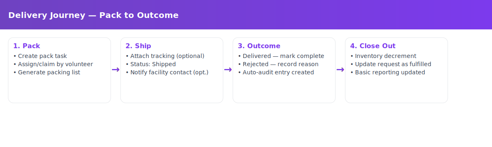

# Ink & Iron - Team Silver
> _Note:_ This document will evolve throughout your project. You commit regularly to this file while working on the project (especially edits/additions/deletions to the _Highlights_ section). 
 > **This document will serve as a master plan between your team, your partner and your TA.**

## Product Details
 
#### Q1: What is the product?

Ink & Iron is a web application that makes literature and educational resources accessible to incarcerated individuals across Canada by streamlining how donated books are collected, catalogued, approved by facilities, and delivered, while giving donors and volunteers transparent, privacy respecting ways to contribute.

**Problems**: 
Today, prison book programs rely on ad‑hoc spreadsheets, email chains, and manual processes. That makes it hard to:

* keep an accurate inventory of donated books,  
* match incoming requests to available titles and facility rules,  
* coordinate volunteers,  
* and give donors clear, privacy-respecting updates on how their contributions help.

**Partners**:
Our partners are **Caroline Therence** and **Rafiq Omair**, both mechanical engineering interns currently working in education-focused initiatives. The project idea originated from Rafiq’s volunteer work with a U.S. prison book program and aims to establish a sustainable, Canada-wide network. The program is in an early stage, supported by local bookstores in Toronto and other community allies. There is no existing codebase; this is a net-new build.

**What we will build**:
A minimal but usable MVP web application (backend + frontend) with:

  * **Admin interface** to manage donated books, requests, status updates, donors, and volunteers.  
  * **Volunteer portal** to claim tasks (packaging, delivery), track hours, and view assignments.  
  * **Facility staff form** for submitting requests on behalf of incarcerated individuals, with an approve/decline workflow.  
  * **Donation intake** to register donated books and attribute them to donors.  
  * **Basic delivery tracking** through a simple status lifecycle: _Received → Packed → Shipped → Delivered/Rejected_.  

**Examples of how the system will be used**:

- **Volunteer scenario**: A volunteer logs in and sees three open tasks (e.g., *pack 10 books for Facility A*, *pick up a box from Bookstore B*, *drop off a package at the postal depot*). They claim one task, complete it, and mark it finished in the system.  

- **Admin scenario**: An admin receives 30 newly donated books. They scan the ISBNs, the system auto-fills book details, and the admin quickly assigns the books to outstanding facility requests.  

- **Facility staff scenario**: A staff member at a correctional facility submits a request on behalf of an incarcerated individual—for example, “introductory welding” or “Canadian history.” They receive a clear approval decision and an estimated shipment timeline.

#### Q2: Who are your target users?

 **Primary**: Incarcerated individuals (via facility staff) requesting free books for literacy, education, and personal growth.

**Secondary**: 
  * Volunteers (packers, drivers/couriers, intake/cataloguers).
  * Donors (individuals/bookstores) contributing books or funds.
  * Correctional facility staff who approve/submit requests and confirm delivery compliance.
  * Partner organizations and literacy advocates.

**Persona**:

> [!TIP]
> Persona cards below use rich HTML and look best when viewed locally. For the full styled cards, download this file and open it locally (e.g., VS Code Markdown Preview). On GitHub, use the simplified cards right here.
>
> For the persona card, please download and read locally through this file: `Ink_and_Iron/deliverables/D1/planning.md` (use GitHub's Raw button to save).

##### GitHub‑friendly Persona Cards (Simplified)

— Officer Jaspreet Singh — Correctional Program Officer (Facility Staff, Secondary User)
- Quote: “Get approved materials to people quickly, without breaking policy.”
- Summary: Age 42; Work: Correctional Program Officer (Ontario); Family: Married, 1 child; Location: GTA; Character: Policy‑first helper
- Traits: Detail‑oriented; Policy‑driven; Time‑pressed; Empathetic
- Goals: Submit/approve requests quickly and correctly; Ensure shipments comply with facility policies; Track delivery outcomes with minimal back‑and‑forth
- Frustrations: Paper forms and duplicate spreadsheets; Rejections due to unclear rules/packaging; Lack of status visibility once requests are sent
- Preferred Channels: Email (primary) and phone for time‑sensitive items
- Jump to rich HTML card: [View rich card](#persona-facility)

— Maya Chen — Volunteer (Packer & Driver) (Volunteer, Secondary User)
- Quote: “Give me clear tasks I can do between classes.”
- Summary: Age 20; Work: UofT undergrad; part‑time retail; Location: Downtown Toronto; Character: Reliable helper, phone‑first
- Traits: Mission‑driven; Phone‑first; Time‑boxed
- Goals: Find and claim nearby tasks with clear instructions; Log hours and mark tasks complete on mobile; See real‑world impact
- Frustrations: Unclear packaging/label rules → rework; Pickup windows that don’t match availability; Multiple sign‑ups across spreadsheets/forms
- Preferred Channels: Email & Discord; admin dashboard for daily ops; weekly summary exports
- Jump to rich HTML card: [View rich card](#persona-volunteer)

— Alex Thompson — Incarcerated Learner (requests via Facility Staff) (Primary Beneficiary)
- Quote: “Reading helps me learn, focus, and plan for what’s next.”
- Summary: Age 28; Focus: GED prep, trades (intro welding), Canadian history; Access: Requests submitted by staff; Character: Growth‑oriented, resilient
- Traits: Learner; Limited access; Policy constraints
- Goals: Receive permitted books that match learning goals; Minimize wait time; Access study materials that support re‑entry and growth
- Frustrations: Limited catalog visibility; Rejections due to packaging/policy rules; Long, uncertain timelines and few status updates
- Preferred Channels: Indirect — staff‑submitted forms, facility mail; printed confirmations where appropriate
- Jump to rich HTML card: [View rich card](#persona-incarcerated)

<strong>Rich Persona Cards (HTML)</strong> — click to expand (best viewed locally)

 <!-- ===== Persona Cards for Ink & Iron (Q2) ===================================== -->
<!-- Palette: purple #7c3aed | light #ede9fe | gray text #57606a | borders #e6e8eb -->

<!-- Helper: tiny component for sliders/progress bars -->
<!-- (Inline styles only so it renders on GitHub) -->

<section id="persona-facility" style="border:1px solid #e6e8eb;border-radius:14px;overflow:hidden;margin:18px 0;background:#fff;">

  
Officer Jaspreet Singh — Correctional Program Officer

  

    Facility Staff
    Secondary User
  

  

    
👮🏽‍♂️

    <blockquote style="margin:10px 0 0 0;padding:10px;border:1px solid #e6e8eb;border-radius:10px;color:#57606a;background:#f9fafb;">“Get approved materials to people quickly, without breaking policy.”</blockquote>
    

      
<strong>Age</strong> 42

      
<strong>Work</strong> Correctional Program Officer (Ontario)

      
<strong>Family</strong> Married, 1 child

      
<strong>Location</strong> GTA

      
<strong>Character</strong> Policy‑first helper

    

    

      
Personality

      
Introvert — Extrovert

      

      
Thinking — Feeling

      

      
Sensing — Intuition

      

      
Judging — Perceiving

      

    

  

  

    

      Detail‑oriented
      Policy‑driven
      Time‑pressed
      Empathetic
    

    

      
Goals

      <ul style="margin:0 0 10px 18px;color:#111827;">
        <li>Submit/approve requests quickly and correctly.</li>
        <li>Ensure shipments comply with facility policies.</li>
        <li>Track delivery outcomes with minimal back‑and‑forth.</li>
      </ul>
      
Frustrations

      <ul style="margin:0 0 10px 18px;color:#111827;">
        <li>Paper forms and duplicate spreadsheets waste time.</li>
        <li>Shipments get rejected due to unclear rules or packaging.</li>
        <li>Lack of status visibility once requests are sent.</li>
      </ul>
      
Bio

      
Oversees education and mail‑room approvals. Comfortable with simple web forms; needs a system that is fast, reliable, and policy‑aware. Limited time between rounds and reports, so clarity and defaults matter.

    

  

  

    

      
Motivation

      
Incentive

      

      
Fear (errors)

      

      
Growth

      

      
Power (compliance)

      

      
Social (impact)

      

    

    

      
Preferred Channels

      
Email (primary) and phone for time‑sensitive items.

    

  

</section>

<section id="persona-volunteer" style="border:1px solid #e6e8eb;border-radius:14px;overflow:hidden;margin:18px 0;background:#fff;">

  
Maya Chen — Volunteer (Packer & Driver)

  

    Volunteer
    Secondary User
  

  

    
🎒

    <blockquote style="margin:10px 0 0 0;padding:10px;border:1px solid #e6e8eb;border-radius:10px;color:#57606a;background:#f9fafb;">“Give me clear tasks I can do between classes.”</blockquote>
    

      
<strong>Age</strong> 20

      
<strong>Work</strong> UofT undergrad; part‑time retail

      
<strong>Location</strong> Downtown Toronto

      
<strong>Character</strong> Reliable helper, phone‑first

    

    

      
Personality

      
Introvert — Extrovert

      

      
Thinking — Feeling

      

      
Sensing — Intuition

      

      
Judging — Perceiving

      

    

  

  

    

      Mission‑driven
      Phone‑first
      Time‑boxed
    

    

      
Goals

      <ul style="margin:0 0 10px 18px;color:#111827;">
        <li>Find and claim nearby tasks with clear instructions.</li>
        <li>Log hours and mark tasks complete on mobile.</li>
        <li>See real‑world impact of the work.</li>
      </ul>
      
Frustrations

      <ul style="margin:0 0 10px 18px;color:#111827;">
        <li>Unclear packaging/label rules → rework.</li>
        <li>Pickup windows that don’t match availability.</li>
        <li>Multiple sign‑ups across spreadsheets and forms.</li>
      </ul>
      
Bio

      
Balances classes and a part‑time job. Wants bite‑sized tasks and confirmation that the task is done correctly the first time. Prefers push‑style clarity over digging through docs.

    

  

  

    

      
Motivation

      
Incentive (hours/recognition)

      

      
Fear (wasting time)

      

      
Growth

      

      
Power

      

      
Social (impact/peers)

      

    

    

      
Preferred Channels

      
Discord (primary), email summaries, SMS reminders for claimed tasks.

    

  

</section>

<!-- ================= PERSONA 3: Donor ================= -->

  

    
Jordan Ahmed — Donor (Indie Bookstore Owner)

    

      Donor
      Secondary User
    

  

  

    

      
📚

      <blockquote style="margin:10px 0 0 0;padding:10px;border:1px solid #e6e8eb;border-radius:10px;color:#57606a;background:#f9fafb;">
        “I want to know our donated books are wanted—and actually used.”
      </blockquote>
      

        
<strong>Age</strong> 34

        
<strong>Work</strong> Owner, neighbourhood bookstore

        
<strong>Location</strong> Toronto

        
<strong>Character</strong> Community‑minded, time‑limited

      

    

    

      

        Transparent
        Impact‑focused
        Efficient
      

      

        
Goals

        <ul style="margin:0 0 10px 18px;color:#111827;">
          <li>Donate specific titles or categories that are in demand.</li>
          <li>Receive acknowledgment/receipts and simple impact summaries.</li>
          <li>Schedule pickups/drop‑offs with minimal friction.</li>
        </ul>
        
Frustrations

        <ul style="margin:0 0 10px 18px;color:#111827;">
          <li>Not knowing which donations are actually needed.</li>
          <li>Clunky coordination—emails across different people.</li>
          <li>No visibility after dropping off boxes.</li>
        </ul>
        
Bio

        
Runs a small store and manages overstock/returns. Wants to give meaningfully while keeping operations lean. Prefers quick forms and periodic summaries over real‑time dashboards.

      

    

    

      

        
Motivation

        
Incentive (receipts/ops fit)

        

        
Fear (waste)

        

        
Growth (community)

        

        
Power

        

        
Social (giving back)

        

      

      

        
Preferred Channels

        
Email (confirmations), quick web forms, scheduled pickup windows.

      

    

  

<!-- ================= PERSONA 4: Admin / Coordinator ================= -->

  

    
Samira Patel — Program Coordinator (Admin)

    

      Admin
      Core User
    

  

  

    

      
🗂️

      <blockquote style="margin:10px 0 0 0;padding:10px;border:1px solid #e6e8eb;border-radius:10px;color:#57606a;background:#f9fafb;">
        “One source of truth. Clear tasks. No spreadsheet spaghetti.”
      </blockquote>
      

        
<strong>Age</strong> 29

        
<strong>Work</strong> Nonprofit program coordinator

        
<strong>Location</strong> Toronto

        
<strong>Character</strong> Systems thinker, security‑minded

      

    

    

      

        Organized
        Data‑aware
        Collaborative
      

      

        
Goals

        <ul style="margin:0 0 10px 18px;color:#111827;">
          <li>Maintain accurate inventory and request statuses.</li>
          <li>Coordinate volunteers and shipments with audit trails.</li>
          <li>Report basic metrics to partners and supporters.</li>
        </ul>
        
Frustrations

        <ul style="margin:0 0 10px 18px;color:#111827;">
          <li>Spreadsheet duplication and version conflicts.</li>
          <li>Manual, error‑prone matching of books to requests.</li>
          <li>Unclear facility constraints → rejected packages.</li>
        </ul>
        
Bio

        
Leads day‑to‑day operations and communications. Needs role‑based access controls, simple exports, and a clear dashboard to prevent bottlenecks and keep volunteers engaged.

      

    

    

      

        
Motivation

        
Incentive (efficiency)

        

        
Fear (data/privacy)

        

        
Growth (scale ops)

        

        
Power (control of workflow)

        

        
Social (mission impact)

        

      

      

        
Preferred Channels

        
Email & Discord; admin dashboard for daily ops; weekly summary exports.

      

    

  

<!-- ================= PERSONA 5: Incarcerated Learner (via staff) ================= -->

  

    
Alex Thompson — Incarcerated Learner (requests via Facility Staff)

    

      Primary Beneficiary
    

  

  

    

      
📖

      <blockquote style="margin:10px 0 0 0;padding:10px;border:1px solid #e6e8eb;border-radius:10px;color:#57606a;background:#f9fafb;">
        “Reading helps me learn, focus, and plan for what’s next.”
      </blockquote>
      

        
<strong>Age</strong> 28

        
<strong>Focus</strong> GED prep, trades (intro welding), Canadian history

        
<strong>Access</strong> Requests submitted by facility staff; limited communication

        
<strong>Character</strong> Growth‑oriented, resilient

      

    

    

      

        Learner
        Limited access
        Policy constraints
      

      

        
Goals

        <ul style="margin:0 0 10px 18px;color:#111827;">
          <li>Receive books that match learning goals and permitted genres.</li>
          <li>Minimize wait time between request and delivery.</li>
          <li>Access study materials that support re‑entry and growth.</li>
        </ul>
        
Frustrations

        <ul style="margin:0 0 10px 18px;color:#111827;">
          <li>Limited catalog visibility; can’t browse directly.</li>
          <li>Rejections due to packaging or policy rules.</li>
          <li>Long, uncertain timelines and few status updates.</li>
        </ul>
        
Bio

        
Submits requests through staff and depends on them for updates. Motivated to learn and prepare for certification exams and future employment opportunities. Values consistent, reliable deliveries and relevant titles.

      

    

    

      

        
Motivation

        
Incentive (progress)

        

        
Fear (delays/rejections)

        

        
Growth (education)

        

        
Power (agency)

        

        
Social (connection)

        

      

      

        
Preferred Channels

        
Indirect: staff‑submitted forms, facility mail; printed confirmations where appropriate.

      

    

  

<!-- ============================================================================ -->

#### Q3: Why would your users choose your product? What are they using today to solve their problem/need?

**Today:** Requests are managed with emails, spreadsheets, paper forms, and scattered chats. This causes duplicate work, lost context, long wait times, and frequent rejections due to unclear policies.  

**Why Ink & Iron fits:**  
- **Saves time:** One platform for intake, approvals, inventory, and volunteer tasks, cutting down on email chains and manual matching.  
- **Improves accuracy:** Centralized inventory and request data create a single source of truth with an audit trail.  
- **Increases transparency:** Volunteers see clear tasks; donors get simple acknowledgments and impact updates.  
- **Reduces errors:** Facility rules are built in, lowering the chance of rejected shipments.  
- **Mission-aligned:** Directly supports literacy and education access for incarcerated learners by moving books faster and more reliably.  

**How this differs from today:**  
- **Staff** approve and track requests in one place (no duplicate spreadsheets).  
- **Volunteers** claim clear, mobile-friendly tasks instead of chasing messages.  
- **Donors** give what’s needed and see confirmation their books were used.  
- **Admins** manage everything from a single dashboard.  
- **Learners** ultimately get the right books sooner, with fewer delays.

#### Q4: What are the user stories that make up the Minumum Viable Product (MVP)?

We have documented our MVP user stories with acceptance criteria and published them as an artifact.  
You can view them here: [Ink & Iron — User Stories)](https://heidiyf.notion.site/Ink-Iron-User-Stories-277e46891070819bb590d1e041833e24?source=copy_link).

  
Story 1 — Admin manages inventory

  
<strong>User Story:</strong> As an <b>admin</b>, I want to <b>add and manage donated books</b> so that <b>inventory stays accurate and requests can be fulfilled</b>.

  
Acceptance Criteria

  <ul style="margin:0 0 0 18px;">
    <li>When an admin enters a valid ISBN/title/condition, then the book is saved to inventory and visible on the admin list.</li>
    <li>When details are edited or a book is archived, then the change appears immediately on the list and history is recorded.</li>
    <li>If required fields are missing/invalid, then the form blocks submission and shows an inline message.</li>
  </ul>

  
Story 2 — Facility staff submit requests

  
<strong>User Story:</strong> As a <b>facility staff member</b>, I want to <b>submit book requests on behalf of an inmate</b> so that <b>they can receive permitted materials</b>.

  
Acceptance Criteria

  <ul style="margin:0 0 0 18px;">
    <li>When staff submit a request with required fields (topic, facility, inmate ref), then a request ID and “Pending” status are created.</li>
    <li>If the topic/format conflicts with a facility rule, then the request is flagged for review before approval.</li>
    <li>When a decision is recorded (Approved/Declined with reason), then status updates and is visible on the admin list.</li>
    <li>Personal information is minimized — only fields required by facility policy (e.g., inmate ref ID) are stored.</li>
  </ul>

  
Story 3 — Volunteer claims tasks

  
<strong>User Story:</strong> As a <b>volunteer</b>, I want to <b>claim and complete packing/pickup/drop-off tasks</b> so that <b>I can help fulfill requests</b>.

  
Acceptance Criteria

  <ul style="margin:0 0 0 18px;">
    <li>When a volunteer opens the task queue, then open tasks show type, due date, and destination.</li>
    <li>When the volunteer clicks “Claim”, then the task is assigned to them and hidden from other volunteers.</li>
    <li>When they mark the task “Complete”, then status moves forward (e.g., to Packed or Shipped) and time is logged.</li>
  </ul>

  
Story 4 — Donor logs and tracks donations 

  
<strong>User Story:</strong> As a <b>donor</b>, I want to <b>donate books in person and receive a donor ID with a tracking link </b> so that <b>I can check which books I’ve donated and see their status. </b>.

  
Acceptance Criteria

  <ul style="margin:0 0 0 18px;">
    <li> When a donor drops off books in person and provides their email, then the system creates a donation record.</li>
    <li>When the record is created, the donor receives a confirmation email with a unique donor ID and a link to view their donations.</li>
    <li>When an admin processes the donation, the books are linked to the donor’s ID and visible in their donation history.</li>
    <li>If any items are rejected, the donor’s view clearly shows the rejection reason.</li>
  </ul>

  
Story 5 — Admin tracks fulfillment

  
<strong>User Story:</strong> As an <b>admin</b>, I want to <b>move requests through statuses</b> so that <b>everyone has clear visibility from intake to delivery</b>.

  
Acceptance Criteria

  <ul style="margin:0 0 0 18px;">
    <li>When an admin updates a request, then status changes along the lifecycle: Received → Packed → Shipped → Delivered/Rejected.</li>
    <li>When a shipment is rejected, then a rejection reason is required and stored with the record.</li>
    <li>If a tracking number is entered, then it is saved, marked as optional, and visible on the request detail view.</li>
  </ul>

#### Partner Confirmation

As required, we shared our user stories with our partner for review. They confirmed alignment with the MVP features.  Below is evidence of partner approval:

#### Q5: Have you decided on how you will build it? Share what you know now or tell us the options you are considering.

**Tech stack (as agreed)**:

* Frontend: Next.js

* Backend: Next.js API routes (co‑located)

* Database/ORM: Supabase (Postgres) + Prisma

* Auth: Supabase Auth (email magic link / password)

* Hosting: Vercel (app) + Supabase (DB/auth/storage)

----
## Intellectual Property Confidentiality Agreement 
> Note this section is **not marked** but must be completed briefly if you have a partner. If you have any questions, please ask on Piazza.
>  

After discussion, we all agree that:  

While we (the student team) are encouraged to show our work publicly (e.g., on resumes, in interviews, or portfolios), the source code itself should not be published on GitHub or other public domains, since our partner plans to use it after the course.  

----

## Teamwork Details

#### Q6: Have you met with your team?

Yes — we had a team-building exercise on Zoom where we played an online game of agar.io together.  
This was a relaxed and fun way to bond outside of coursework, and it helped us get to know each other on a more personal level while sharing some laughs.  

  

**Three Fun Facts:**  
1.  David has eaten live scorpions.
2. Andy is a good driver.
3. Qianfeng has eaten crocodile.

#### Q7: What are the roles & responsibilities on the team?

Team Members:  
- David Groshens  
- Andy Ren  
- Runtong Liang  
- Heidi Wang (Team Coordinator / Partner Liaison)  
- Richard Chen  
- Qianfeng Wen\

**Roles & Responsibilities**

- **David Groshens — Backend Developer (Inventory Management)**  
  - *Responsibilities*:  Designs and implements API endpoints for inventory management and email management. Ensures backend logic supports constraints.  
  - *Why this role*: Has prior backend coursework experience; interested in system design and have previously worked a lot with API’s.  

- **Andy Ren — Backend Developer (Volunteer Task Queue)**  
  - *Responsibilities*: Focuses on volunteer task queue APIs and status update endpoints. Works with David to ensure consistency across backend modules.  
  - *Why this role*: Enjoys backend problem solving and wants to strengthen skills in API development.

- **Runtong Liang — Front End Developer, Partner Liaison + Frontend Developer (Public Pages) (Tracking pages)(Directory Page)**  
  - *Responsibilities*: Oversees testing strategy, deployment setup, and integration between frontend and backend. Provides backend support where needed.  
  - *Why this role*: Keen to learn more about DevOps/integration practices; balances backend contribution with testing focus.  

- **Heidi Wang — Team Coordinator / Partner Liaison + Frontend Developer (Volunteer Dashboard & Requests)**  
  - *Responsibilities*: Coordinates team logistics, manages partner/TA communication, and ensures deliverables are on track. On the development side, work on the volunteer dashboard and request submission UI, making sure it is simple and intuitive for users.
  - *Why this role*: I enjoy organizing and leading projects, and since I want to move toward management career-wise, Also want to strengthen my frontend skills by building meaningful interfaces.

- **Richard Chen — Frontend Developer (Donor Intake & Admin Dashboard)**  
  - *Responsibilities*: Focuses on donor intake forms and admin dashboard UI components. Works closely with Heidi and Raymond to align frontend design consistency.
  - *Why this role*: Interested in improving frontend skills and has some prior experience with React. 

- **Qianfeng Wen — Backend Developer (Database & Rules)**  
  - *Responsibilities*: Designs and manages database schema for books, requests, donors, and volunteers. Works with the backend team to optimize queries and enforce rules.
  - *Why this role*: Interested in database management; brings strong SQL knowledge.  

  
#### Q8: How will you work as a team?

**Partner Meetings**  
- **Recurring Schedule**: Weekly online check-ins (Zoom/Discord) with our partner as needed, schedule on Sundays at 3PM.  
- **Purpose**: Share progress, confirm priorities, ask clarifying questions, and get feedback on deliverables.  

- **Partner Meeting 1 (Sept 19)**:  
  - Introductions between our team and the partner.  
  - Understood the project goals, MVP scope, and high-level expectations.  
  - Session was recorded and shared for reference.  

- **Partner Touchpoint (Sept 23)**:  
  - Shared our draft MVP user stories and published artifact link.  
  - Confirmed partner preferences on Intellectual Property & Confidentiality (option 5).  
  - Asked about policy-related constraints and UI/UX preferences.  
  - Communication happened via messages rather than a live meeting.  

**Team Meetings**  
- **Recurring Schedule**: At least once per week on Discord/Zoom, outside of tutorials.  
- **Purpose**: Provide progress updates, review work, clarify blockers, and assign tasks.  

**Coding Sessions**  
- Scheduled ad hoc as the project progresses (Discord calls or in-person).  
- Purpose: Pair programming, tackling complex features, and keeping code consistent.  

**Code Reviews**  
- Conducted directly on GitHub. Every pull request must be reviewed before merging.  
- Notifications piped into our Discord channel so everyone stays in the loop.  
- Purpose: Ensure code quality and shared understanding.  

#### Q9: How will you organize your team?

- **Team Communication:** Discord (daily async updates), Zoom (weekly syncs, ad hoc coding sessions).  
- **Partner Communication:** Email (formal deliverables, approvals), Discord/Zoom (day-to-day and weekly check-ins).  
- **Task-Board / To-do list:** Jira  

**Task Workflow**  
- Tasks are created in Jira by the Team Coordinator or any member raising a new item.  
- Each task follows a workflow: **Backlog → To Do → In Progress→ Done**.  
- Team members self-assign tasks
- All tasks must include a description and assignee before moving to “In Progress.”  
- Pull requests in GitHub link to the corresponding Jira ticket for traceability.  

**Prioritization**  
- High-priority tasks (MVP-related features, partner feedback) are flagged and tackled first.  
- We review and re-prioritize tasks weekly during our team sync.  

**Meeting Minutes**  
- Minutes from both partner and internal meetings are stored in the `/deliverables/minutes/` folder of our repo.  
- Each entry includes: length, date, attendees, agenda, and key decisions.  
- The TA and partner will have direct access to these minutes via the repo.  

**Access**  
- Jira board access will be granted to the TA and partner so they can view progress transparently.  
- GitHub repo is shared with all team members and instructors.   

#### Q10: What are the rules regarding how your team works?

**Communications:**  
- Team members are expected to respond on Discord within **12 hours**.  
- A dedicated Discord channel has been created for the project; urgent issues can also be raised via direct messages.  
- Weekly syncs are held on Zoom or Discord voice; notes are stored in `/deliverables/minutes/`.  
- Heidi Wang (Coordinator) is the **partner liaison**, responsible for ensuring partner questions are answered and updates are communicated.  
- Partner communication will primarily take place via **Discord (shared channel)** and **Zoom meetings**. Email is used for formal deliverables and confirmations.  

**Collaboration & Accountability:**  
- Every team member is expected to attend scheduled meetings unless they provide advance notice.
- Action items from each meeting are logged in Jira and assigned to specific team members with due dates.  
- If a task stalls, it will be flagged in the next team sync.  

**Escalation Process (non-responsiveness or lack of contribution):**  
1. Reach out privately on Discord to check in and offer support.  
2. If there’s no response, bring the issue up at the next team meeting.  
3. Escalate to the TA for mediation.  
4. As a last resort, request that the team member step down from the project. 

## Organisation Details

#### Q11. How does your team fit within the overall team organisation of the partner?
**Our role:** End-to-end product development (greenfield) — building the first usable MVP web platform.  

**Why this fits:**  
- The partners (Caroline and Rafiq) are early-stage organizers without an existing codebase. They asked us to **start the web aspect from scratch**, and are flexible on technical choices.  
- Their role is to provide domain expertise, feature priorities, and feedback. Our role is to **translate this input into scoped user stories, prototypes, and working software**.  
- Success, per partner, prioritizes an **admin interface** (inventory, requests, volunteer tracking) and **volunteer flows**; facility request intake is desirable but secondary for D1/D2.  
- Weekly check-ins plus a shared Discord channel allow quick clarification and iteration.

**Examples of the work we’ll own:**  
- Define and implement the **admin dashboard**, **volunteer task queue**, **inventory module**, **facility directory**, and **request intake workflows** (approve/decline + allocation).  
- Model the **delivery/status lifecycle** (Received → Packed → Shipped → Delivered/Rejected), keeping it status-only for MVP (no external carrier integrations).  
- Establish **product hygiene**: role-based access control, audit notes, and basic reporting so the system remains trustworthy as it scales.  

#### Q12. How does your project fit within the overall product from the partner?

**Big picture:**  
Our MVP is the first public-facing and operations-facing incarnation of *Ink & Iron*. It lays the foundation for a Canada-wide network by proving the core flows: request → match → pack → ship → deliver/refuse, plus volunteer and donation operations.  
The site map and page inventory includes:  
- **Public:** Home, Request, Track, Facilities, Donate, FAQ, Contact  
- **Private:** Volunteer, Admin

**Ownership & boundaries (this term):**  
- **We own:** Core web app (public pages, volunteer area, admin area), facility rules directory, inventory management (add/list/filter), request intake and approval, and status tracking.  
- **Partner provides:** Feature priorities, facility rules information, content, and existing spreadsheets (books, partners).

**What the partner considers success now:**  
- A **functional Admin dashboard** with visibility and control over inventory, requests, and volunteers.  
- A **Volunteer queue** to claim and complete tasks, with basic hours logging.  
- **Facility-submitted requests** with an approve/decline flow and visible state transitions (Received → Matched → Shipped → Delivered/Refused).  
- **Public-facing pages** to explain the mission and enable action (donate, request, track).

## Potential Risks

#### Q13. What are some potential risks to your project?
- **R1 — Clarifications may take time**  
  Some details (such as a feature sheet and written documentation) are still to be shared. It may take time to confirm certain requirements, which could affect how quickly we finalize scope.

- **R2 — Wide range of ideas**  
  Many valuable features were discussed (admin, volunteer tasks, request intake, deliveries, partner lists, events, tracking). With a fixed timeline, it will be important to keep the MVP manageable.

- **R3 — Starting from scratch**  
  Since there is no existing system, our team will need to define data models, flows, and roles. Early decisions may need to be adjusted as we learn more.

- **R4 — Handling personal information**  
  The system will involve limited personal data (names, facility, inmate IDs, mailing addresses). We need to ensure it is stored and managed responsibly.

- **R5 — Different facility policies**  
  Provincial and federal facilities in Canada may have varying rules for book donations. These differences could impact request approval and packaging workflows.

- **R6 — Level of delivery tracking**  
  A transparent shipment status is a goal, but the exact level of tracking (basic manual updates vs. more detailed tracking numbers) is not yet defined.

- **R7 — Content and data inputs**  
  Public-facing pages and initial inventory/request samples will need supporting content (e.g., facility rules, partner lists, book data). Availability of this information may influence how quickly we can build certain sections.

- **R8 — Multiple communication channels**  
  We will primarily use Discord alongside email. With both channels available, it will be important to keep decisions and notes organized so nothing is missed.

---

#### Q14. What are some potential mitigation strategies for the risks you identified?
- **M1 — Regular check-ins and shared notes (R1, R8)**  
  Continue with weekly Sunday meetings and use Discord for day-to-day communication. Summarize discussions in shared notes or a decision log so everyone has a single reference point.

- **M2 — Clear MVP focus (R2)**  
  Confirm a core MVP scope with the partner:  
    - Admin dashboard (inventory, requests, volunteers)  
    - Volunteer task queue with basic hours logging  
    - Facility-submitted requests with approve/decline + status changes  
    - Public pages for mission, donating, requesting, and tracking  
  Additional features can be noted for future iterations.

- **M3 — Iterative approach (R3)**  
  Start with a simple data model (Books, Requests, Facilities, Volunteers, Shipments). Validate early with the partner, then expand as needed.

- **M4 — Privacy-first design (R4)**  
  Collect only the information that is necessary, apply role-based access, and use encryption where possible. Share a brief note on data handling with the partner for transparency.

- **M5 — Facility rules as flexible content (R5)**  
  Create a facility rules directory as editable content, so differences can be captured without major code changes.

- **M6 — Simple shipment statuses first (R6)**  
  Begin with a manual status flow (Received → Packed → Shipped → Delivered/Rejected) and allow optional entry of a tracking number. More detailed tracking can be added later.

- **M7 — Use sample data early (R7)**  
  Populate the system with example entries (books, requests, facilities) to validate workflows. Replace with real content from the partner as it becomes available.
